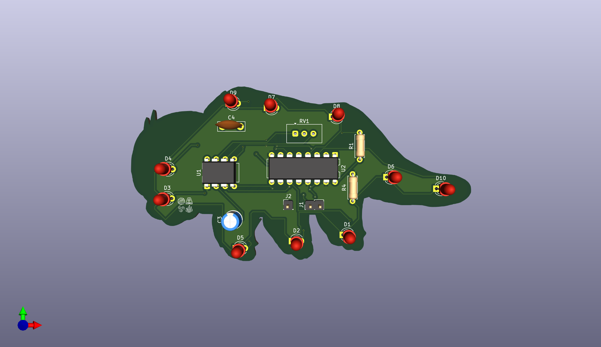
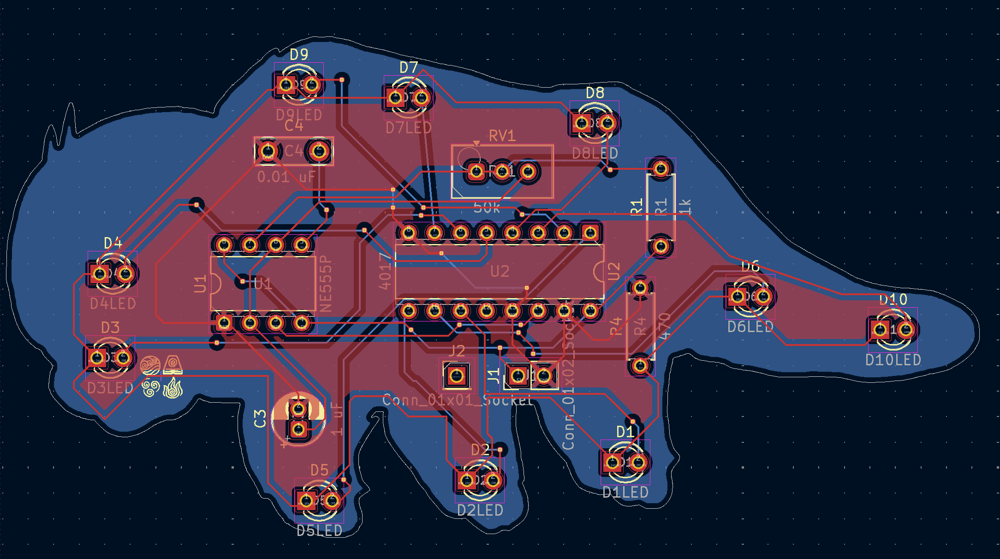
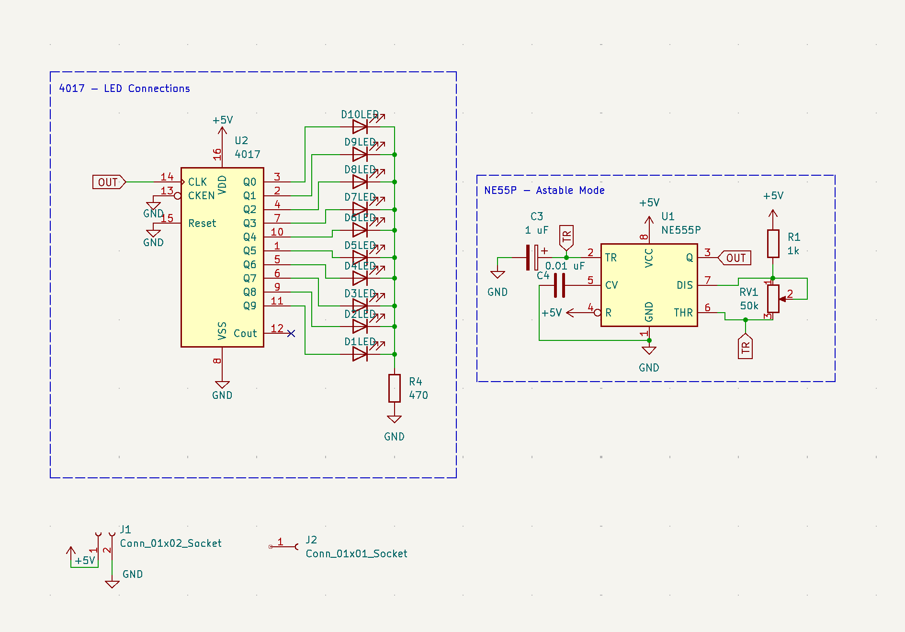

# 555 LED Chaser PCB



---

## What is this?

This is a **555 LED Chaser** — a PCB that blinks 10 LEDs in a sequential, looping pattern using a classic NE555 timer IC and a CD4017 decade counter. The 555 generates a clock signal, and the 4017 steps through each of its 10 outputs one by one, lighting up each LED in turn. A potentiometer lets you dial the blink speed from slow and hypnotic to rapid-fire fast.

I made this project to learn the basics of PCB design — schematics, layout, routing, and getting a real board manufactured. It's a fun, tangible first project because you can actually *see* it working the moment you power it up.

---

## How to Use It

1. Power the board with **5V** through the JST/pin header connector (positive to VCC, negative to GND).
2. The LEDs will immediately begin chasing in sequence.
3. Turn the **potentiometer** clockwise to speed up the chase, counter-clockwise to slow it down.
4. Swap in different colored LEDs from the included kit to customize the look!

No firmware needed — this is a fully analog/logic circuit.

---

## PCB



The board was designed in **KiCad**. It is a 2-layer PCB kept under 100×100mm. The outline is custom-shaped (not a plain rectangle!), and silkscreen art + labels have been added for personality.

---

## Schematic / Wiring Diagram



Key wiring notes:
- NE555 is wired in **astable mode** — it continuously oscillates and drives the CLK pin of the CD4017.
- CD4017 Q0–Q9 outputs each drive one LED.
- All LED cathodes share a single **470Ω current-limiting resistor** to GND.
- A **potentiometer** in the 555's RC network controls oscillation frequency (blink speed).
- CLEN and Reset on the CD4017 are tied to GND; Cout is left unconnected.

---

## Bill of Materials (BOM)

| # | Component | Value / Part | Qty | Link |
|---|-----------|-------------|-----|------|
| 1 | 555 Timer IC | [NE555P](https://www.digikey.com/en/products/detail/texas-instruments/NE555P/277735) | 1 | [DigiKey](https://www.digikey.com/en/products/detail/texas-instruments/NE555P/277735) |
| 2 | Decade Counter IC | [CD4017BE](https://www.digikey.com/en/products/detail/texas-instruments/CD4017BE/67073) | 1 | [DigiKey](https://www.digikey.com/en/products/detail/texas-instruments/CD4017BE/67073) |
| 3 | Resistor | 1kΩ | 2 | [DigiKey](https://www.digikey.com/en/products/detail/yageo/CFR-25JB-52-1K/338) |
| 4 | Resistor | 470Ω | 1 | [DigiKey](https://www.digikey.com/en/products/detail/yageo/CFR-25JB-52-470R/343) |
| 5 | Potentiometer | 100kΩ | 1 | [DigiKey](https://www.digikey.com/en/products/detail/bourns-inc/3386P-1-104LF/1088979) |
| 6 | Electrolytic Capacitor | 10µF | 1 | [DigiKey](https://www.digikey.com/en/products/detail/panasonic-electronic-components/ECA-1HM100/245067) |
| 7 | Ceramic Capacitor | 0.01µF | 1 | [DigiKey](https://www.digikey.com/en/products/detail/kemet/C320C103K5R5TA/818254) |
| 8 | LEDs (assorted colors) | 5mm through-hole | 10 | [DigiKey](https://www.digikey.com/en/products/detail/kingbright/WP7113ID/1747663) |
| 9 | Pin Header (power) | 1×2 | 2 | [DigiKey](https://www.digikey.com/en/products/detail/adam-tech/PH2-02-UA/9830344) |
| 10 | PCB | Custom, 2-layer | 1 | [JLCPCB](https://jlcpcb.com) |

> Full BOM also available as `bom.csv` in the root of this repository.

---

## Repository Structure

```
555-chaser/
├── README.md
├── bom.csv
├── images/
│   ├── 3d_render.png
│   ├── pcb_layout.png
│   └── schematic.png
├── kicad/
│   ├── 555-chaser.kicad_pro
│   ├── 555-chaser.kicad_sch
│   ├── 555-chaser.kicad_pcb
│   └── gerbers/
│       └── gerbers.zip
```

---

## Made with ❤️ for Hack Club Blueprint
